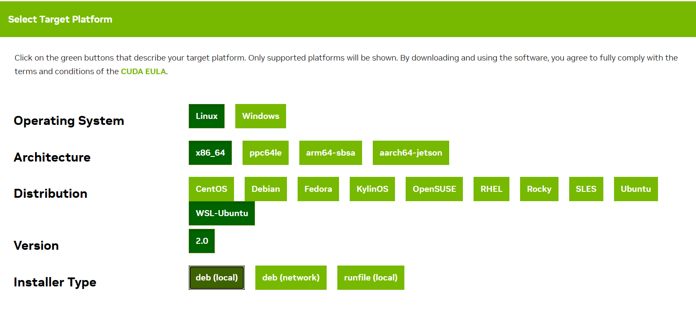
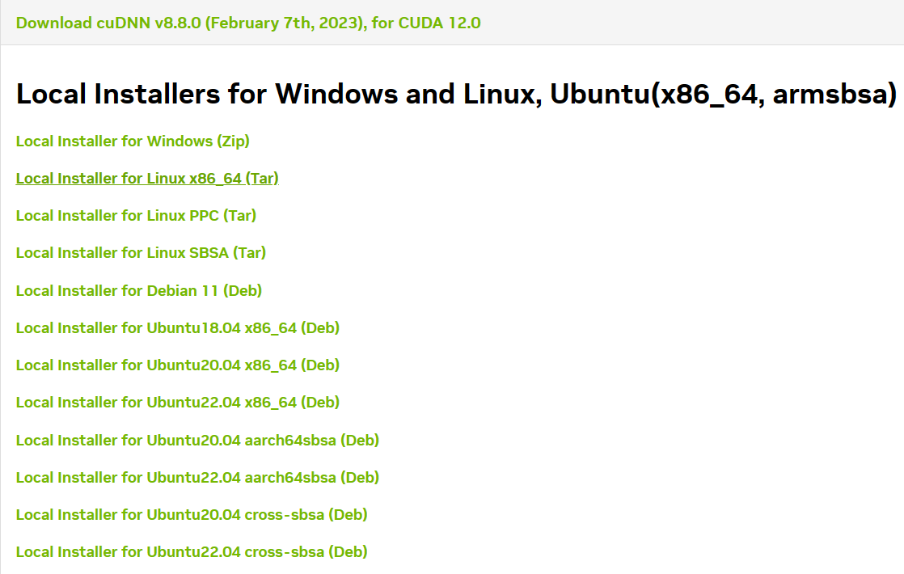

After a long time of saving money, I finally bought a high-end gaming laptop, not just for games but also for working. Somebody may wonder why I don't build a powerful PC instead of a laptop. However, a high-end gaming laptop can be optimal when your job needs frequent movement or your room lacks space for a huge PC.

My laptop is Lenovo 7 16IAX7 with Core i7 12800HX CPU, Geforce RTX 3070 Ti GPU and DDR5 16GB RAM. It's a beast for games and deep learning (at least for testing my code)!

Now when Windows 11 introduces Windows Subsystem Linux 2 (WSL2) with more support, we don't need to install a different Linux system that you can struggle to install alongside Windows on your laptop.

The GPU deep learning environment in Windows 11 can be consist of following steps.

## 1. Install WSL2 on Windows 11

Let's install WSL2 on Windows 11. First, you open **Windows PowerShell** as `Administrator` mode and see which available Linux distributions for installation on WSL2 with following command:

```bash
# list all Linux distribution available
wsl --list --online
```

This time we will install Ubuntu 22.04.

```bash
# install Linux distribution Ubuntu
wsl --install -d Ubuntu
```

If you have many WSL distributions, you can set the default WSL distribution by following commands:

```bash
# shutdown all wsl distributions
wsl --shutdown

# define default wsl distribution to use with wsl
wsl -s <DistributionName>
```


The WSL distrubution will be installed in system drive in default, if you want to locate your WSL distribution in a non-system drive, please read more in [here](https://castorfou.github.io/guillaume_blog/blog/wsl2-conda-mamba-cuda.html).


## 2. Install Developement Tools

Before installing the drivers and cuDNN, I suggest you update and install some necessary tools for your WSL distro.

```bash
# update the system
sudo apt update -y

# upgrade the system
sudo apt upgrade -y

# install some development tools
sudo apt install -y build-essential pkg-config

# install additional tools
sudo apt install -y curl wget uget tar zip unzip rar unrar

# install python3
sudo apt install -y python3 python3-dev python3-pip python3-setuptools python3-venv

# install git
sudo apt install -y git
git config --global user.name "name"
git config --global user.email "name@domain.com"
```


Copy your own Github SSH keys to `~/.ssh`.


## 3 Install NVIDIA Graphics Drivers on Windows 11

I recommend installing GeForce Experience Drivers. GeForce Experience is a utility that manages the graphics drivers of NVIDIA's GeForce family of products, optimizes them for various PC games, and provides recording capabilities.

From checking for the latest drivers to installing, you can easily do it with the GUI. The download is available at [this site](https://www.nvidia.com/ja-jp/geforce/geforce-experience/).

The graphics driver is installed at the same time that you install GeForce Experience. Reboot the computer before continuing the next step.

## 3. Install CUDA on WSL2

Once the graphics driver is installed, install CUDA. Suppose you select items according to the system at hand from [CUDA Toolkit download site](https://developer.nvidia.com/cuda-downloads). In that case, it will suggest commands according to it.



We will continue to execute the commands that have appeared.

```bash
wget https://developer.download.nvidia.com/compute/cuda/repos/wsl-ubuntu/x86_64/cuda-wsl-ubuntu.pin
sudo mv cuda-wsl-ubuntu.pin /etc/apt/preferences.d/cuda-repository-pin-600
wget https://developer.download.nvidia.com/compute/cuda/12.1.0/local_installers/cuda-repo-wsl-ubuntu-12-1-local_12.1.0-1_amd64.deb
sudo dpkg -i cuda-repo-wsl-ubuntu-12-1-local_12.1.0-1_amd64.deb
sudo cp /var/cuda-repo-wsl-ubuntu-12-1-local/cuda-*-keyring.gpg /usr/share/keyrings/
sudo apt-get update
sudo apt-get -y install cuda
```

Finally, let's add CUDA's path to the system environment by adding the `PATH` and `LD_LIBRARY_PATH` variables to `~/.bashrc`.

```bash
nano ~/.bashrc

# at the end of ~/.bashrc file
export PATH=/usr/local/cuda/bin:$PATH
export LD_LIBRARY_PATH=/usr/local/cuda/lib64:/usr/local/cuda/extras/CUPTI/lib64:$LD_LIBRARY_PATH
# Ctrl + S to save the modification
# Ctrl + X to exit the editor

# activate .bashrc file's change
source .bashrc
```

If it finishes successfully, CUDA operation is fine.


## 4. Install cuDNN

cuDNN is a library for deep learning provided by NVIDIA. Since the calculation of neural networks is accelerated, it is an essential library for those who do deep learning. It can be downloaded from [this site](https://developer.nvidia.com/cudnn). You must participate in the NVIDIA Developer Program to download. 



When the download is completed, execute the following commands.

```bash
tar -xvf cudnn-linux-x86_64-8.x.x.x_cuda.X.Y-archive.tar.xz
sudo cp cudnn-*-archive/include/cudnn*.h /usr/local/cuda/include
sudo cp -P cudnn-*-archive/lib/libcudnn* /usr/local/cuda/lib64
sudo chmod a+r /usr/local/cuda/include/cudnn*.h /usr/local/cuda/lib64/libcudnn*
```

Next we will perform the installation.

```bash
sudo dpkg -i cudnn-local-repo-[OS]-8.x.x.x_1.0-1_amd64.deb
sudo cp /var/cudnn-local-repo-[OS]-8.x.x.x/cudnn-local-*-keyring.gpg /usr/share/keyrings/
sudo apt-get update
sudo apt-get install libcudnn8=8.x.x.x-1+cudaX.Y
sudo apt-get install libcudnn8-dev=8.x.x.x-1+cudaX.Y
sudo apt-get install libcudnn8-samples=8.x.x.x-1+cudaX.Y
```


`8.x.x.x` and `X.Y` are the version of cuDNN and CUDA, while `[OS]` is the Operation System's version. to make sure the correct version, you can check in `/var/cudnn-local-repo-[OS]-8.x.x.x`.


Finally, check the operation of cuDNN.

```bash
$ cp -r /usr/src/cudnn_samples_v8/ $HOME
$ cd  $HOME/cudnn_samples_v8/conv_sample
$ make clean && make
$ bash run_conv_sample
```

A sample program to run convolution operation under multiple settings will work. If `Test passed!` is displayed, the installation is complete.


If the test failed, the reason may be the `ld-config` connect wrong libcuda. To solve it, you may open **Windows PowerShell** as `Administrator`

```bash
cd C:\Windows\System32\lxss\lib
del libcuda.so
del libcuda.so.1

# run wsl -e /bin/bash to open in WSL and create the symlink
wsl -e /bin/bash
ln -s libcuda.so.1.1 libcuda.so.1
ln -s libcuda.so.1.1 libcuda.so
exit

# back in PowerShell
wsl --shudown

# restart WSL
wsl -e /bin/bash
# check ldconfig
sudo ldconfig
```

Now you can rerun `cudnn_samples_v8/conv_sample/run_conv_sample` again to obtain `Test passed!`.



## 5. Install Mambaforge

Mamba is a fast, robust, and cross-platform package manager. It can run on Windows, OS X, and Linux (ARM64 and PPC64LE included). In addition, it is fully compatible with conda packages and supports most of conda's commands.

For the Linux platform, you can download [Mambaforge](https://github.com/conda-forge/miniforge#mambaforge) and then run the script for installation.

```bash
# download the installer
wget "https://github.com/conda-forge/miniforge/releases/latest/download/Mambaforge-$(uname)-$(uname -m).sh"

# run the downloaded script
bash Mambaforge-$(uname)-$(uname -m).sh
```


If you’d prefer that conda’s base environment not be activated on startup, set the auto_activate_base parameter to false: 

```bash
mamba config --set auto_activate_base false
``` 

Then close the current shell and open a new shell to activate the effect.


Mambaforge comes with the popular conda-forge channel preconfigured. Still, you can modify the configuration to use any channel you like.

## 6. Setup Deep Learning Environement

### 6.1. PyTorch-GPU

```bash
# create virtual env
mamba create -n torchgpu python=3.10

# activate created venv
mamba activate torchgpu

# install necessary packages
pip install --upgrade pip setuptools wheel
mamba install pytorch torchvision torchaudio cudatoolkit=11.7 -c pytorch -c conda-forge
mamba install pytorch-lightning
mamba install scikit-learn scikit-image scipy
mamba install matplotlib seaborn
pip install pandas
pip install --upgrade opencv-python opencv-contrib-python
mamba install tqdm yacs
mamba install jupyter
```

Verification

```bash
$ mamba activate torchgpu
(torchgpu) $ python
>>> import torch
>>> torch.cuda.is_available()
>>> exit()
(torchgpu) $ mamba deactivat
```

### 6.2. Tensorflow-GPU

```bash
mamba create -n tfgpu python=3.10
mamba activate tfgpu
pip install --upgrade pip setuptools wheel
mamba install -c conda-forge cudatoolkit=11.2 cudnn=8.1.0
export LD_LIBRARY_PATH=$LD_LIBRARY_PATH:$CONDA_PREFIX/lib/
pip install tensorflow
mamba install scikit-learn scikit-image scipy
mamba install matplotlib seaborn
pip install pandas
pip install --upgrade opencv-python opencv-contrib-python
mamba install tqdm yacs
```

Verification

```bash
$ mamba activate tfgpu
(tfgpu) $ python
>>> import tensorflow as tf
>>> from tensorflow.python.client import device_lib
>>> print(tf.config.list_physical_devices('GPU'))
>>> device_lib.list_local_devices()
>>> exit()
(tfgpu) $ mamba deactivate
```
